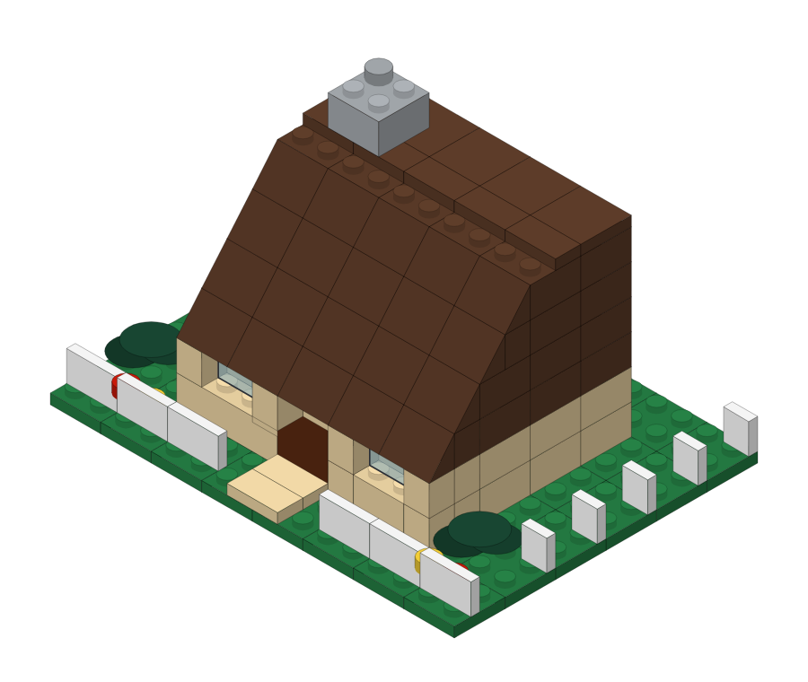
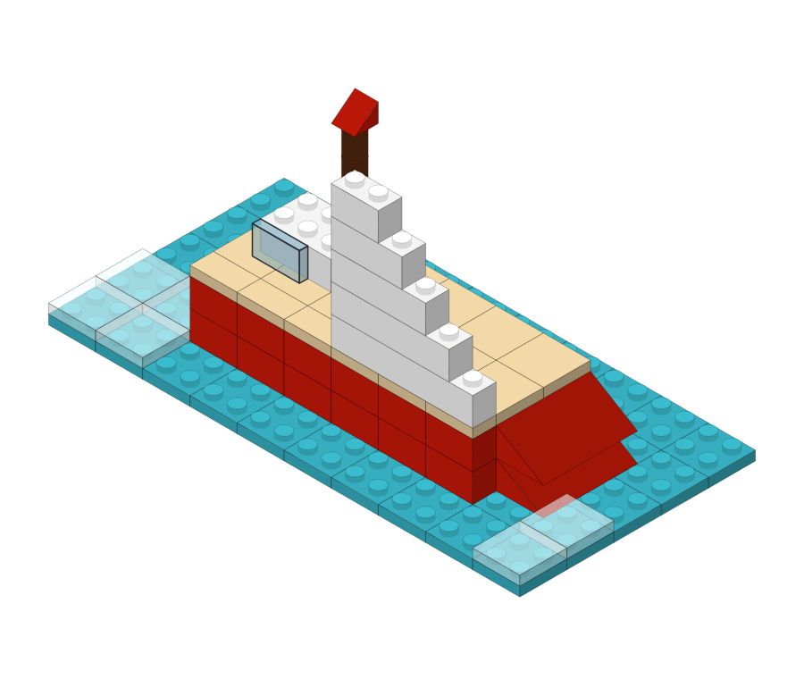
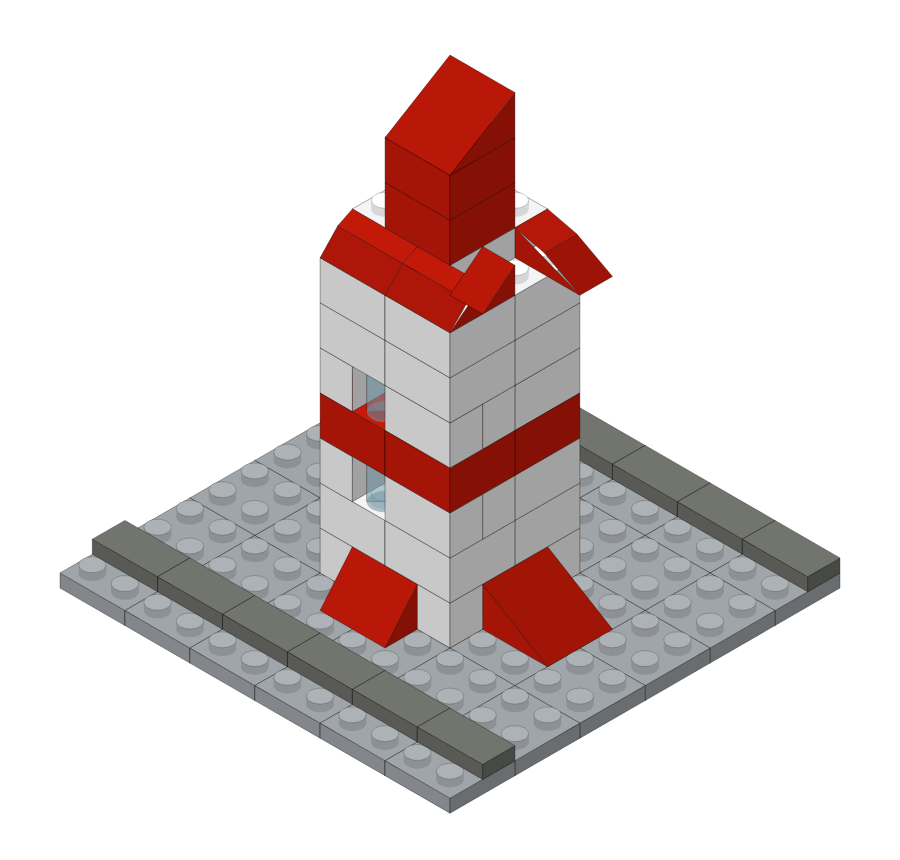
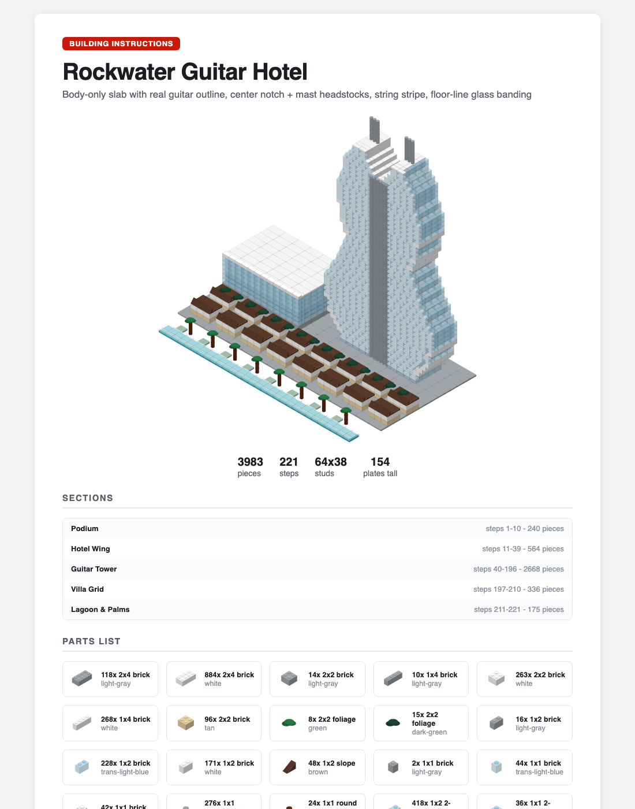
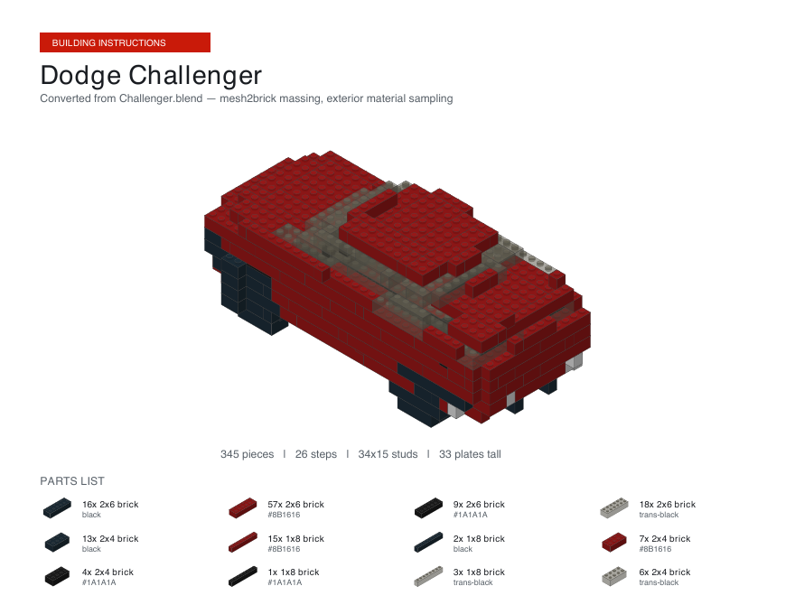

# brick-instructions-skill

An **[Agent Skill](https://github.com/anthropics/skills)** that turns any subject — from a rubber duck to a 3,900-piece resort complex — into LEGO®-style, step-by-step building instructions: a polished HTML booklet or PDF generated from a single canonical `build.json`, validated like an engineer would (collisions, floating bricks, buildable step order, flat-structure detection, piece-inventory limits).

Follows the standard skill layout (`SKILL.md` + `scripts/` + `references/` + `assets/`), so it drops into any skills-aware agent — and ships with a ChatGPT-Project kit for everyone else.

## Install

**Claude Code**
```bash
git clone https://github.com/daem0ndev/brick-instructions-skill ~/.claude/skills/brick-instructions
```
(Project-scoped: clone into `.claude/skills/brick-instructions` inside your repo.)

**OpenClaw**
```bash
git clone https://github.com/daem0ndev/brick-instructions-skill ~/.openclaw/workspace/skills/brick-instructions
```

**Codex / Cursor / any AGENTS.md-style agent** — clone anywhere and point your agent at `SKILL.md` (it's self-contained; everything it references is relative to the repo root):
```bash
git clone https://github.com/daem0ndev/brick-instructions-skill
```

**ChatGPT** — no CLI needed: download the kit from the [latest release](https://github.com/daem0ndev/brick-instructions-skill/releases) and follow its `START-HERE.md`, or see `references/chatgpt-work-setup.md`. The Python renderer is pure stdlib, so it runs in the code-interpreter sandbox as-is.

## Local use (Bun or Python)

```bash
# validate (collisions, floating bricks, build order, flat structures, inventory)
bun scripts/render-instructions.ts validate build.json [--inventory inv.json]
python3 scripts/render_instructions.py validate build.json

# HTML booklet (cover, hero render, parts list, TOC, chaptered steps)
bun scripts/render-instructions.ts render build.json -o instructions.html

# PDF — native vector writer, zero dependencies; REQUIRED for large builds
python3 scripts/render_instructions.py pdf build.json -o instructions.pdf

# LDraw export (opens in BrickLink Studio / LPub3D / LeoCAD)
python3 scripts/render_instructions.py ldr build.json
```

> **Large-build note:** don't print the HTML to PDF via headless Chrome for 300+ piece builds — Chrome flattens the SVG `<use>` reuse and the PDF balloons (82 MB where the native writer produces 5.6 MB). Use the Python `pdf` subcommand.

## Gallery

Every model below went through the full skill pipeline — designed as `build.json`, validated (0 errors), rendered to a complete instruction booklet. Click any image for its full PDF instructions; generators live in [`examples/`](examples/).

| | |
|:---:|:---:|
| [](examples/outputs/duck-instructions.pdf) | [](examples/outputs/cottage-instructions.pdf) |
| **Classic Duck** — 6 pcs · *"Make me LEGO instructions for the classic yellow duck."* | **Brookside Cottage** — 210 pcs · *"A cozy cottage with a slope roof, glass windows, and a fenced garden."* |
| [](examples/outputs/sailboat-instructions.pdf) | [](examples/outputs/rocket-instructions.pdf) |
| **Trade Wind Sloop** — 126 pcs · *"A little sailboat on the water with a tall mainsail."* | **Redline Rocket** — 95 pcs · *"A retro red-and-white rocket on a launch pad."* |

[](examples/outputs/rockwater-true-shape-instructions.pdf)

**Rockwater Guitar Hotel** — 3,983 pcs, 221 steps · Input: reference photos of the Seminole Hard Rock Guitar Hotel (Hollywood, FL) + Showcase scale tier. Glass curtain-wall body following a cosine-interpolated guitar outline, center-notch masts, string stripe, floor-line banding. ([full PDF](examples/outputs/rockwater-true-shape-instructions.pdf))

[](examples/outputs/challenger-instructions.pdf)

**Dodge Challenger** — 345 pcs, 26 steps · Input: a 1.7M-triangle Challenger.blend converted through the mesh-input pipeline (`references/mesh-input.md`) at 40-stud resolution, materials sampled from the mesh, greenhouse glazed in the detail pass. ([full PDF](examples/outputs/challenger-instructions.pdf))


## build.json schema

```jsonc
{
  "title": "Classic Duck",
  "subtitle": "optional",
  "colors": { "custom-name": "#AABBCC" },        // optional palette overrides
  "sections": [                                   // optional chapters for large builds
    { "id": "podium", "title": "Podium", "note": "Ground deck." }
  ],
  "bricks": [
    { "size": [2, 4, 3],      // [width_x studs, depth_y studs, height PLATES] (brick=3, plate=1)
      "pos": [0, 0, 0],       // [x, y, z] — z in plate-levels, 0 = ground
      "rot": 0,               // 90 swaps width/depth
      "color": "yellow",      // named palette or #hex
      "section": "podium",    // optional chapter id
      "step": 1,              // optional; auto-assigned per layer/section if omitted
      "note": "optional tip shown under the step" }
  ]
}
```

## What makes it hold up at scale

- **Sections as chapters** — tag bricks with `section`, get a table of contents, chapter dividers, and per-chapter step runs; everything outside the active chapter renders as a ghosted gray silhouette so each step stays readable.
- **Linear output size** — each step's geometry is emitted once (SVG `<symbol>`/`<use>` in HTML, PDF Form XObjects in the native PDF) and referenced by every later step. A 1,909-piece model renders in <1 s to a ~4 MB HTML / ~6 MB 29-page PDF.
- **Adaptive pacing** — 8 pieces per step for small builds, 16 above 300, 24 above 1,000, matching how real LEGO booklets pace bigger sets.
- **Scale discipline** — the design guide requires computing true minifig-scale size from the subject's real dimensions and asking the user to choose a tier, instead of silently shipping a toy-sized model; a validator warning flags tall structures built as 1-stud-deep flat walls.
- **Physical honesty** — validation implements the connectivity heuristic from CMU's [BrickGPT](https://github.com/AvaLovelace1/BrickGPT) (ICCV 2025 Best Paper): every brick must trace support to the ground, steps must be buildable in order, and inventory constraints are hard errors.

## Repo layout

| Path | What |
|---|---|
| `SKILL.md` | The skill definition — workflow, schema, scale tiers, quality bar |
| `scripts/render-instructions.ts` | Bun/TypeScript renderer (HTML, validate, LDraw) |
| `scripts/render_instructions.py` | Pure-stdlib Python port (adds native PDF; runs in sandboxed interpreters) |
| `references/` | Design guide, BrickLink part registry, ChatGPT project setup |
| `assets/` | Starter build files (duck, 192-piece hotel), inventory format, gallery images |
| `examples/` | Gallery + Rockwater generators and build.json files |
| `examples/outputs/` | Finished instruction PDFs for every example |

## Credits & prior art

Validation approach inspired by **BrickGPT** (CMU, MIT-licensed; formerly LegoGPT); inventory-constrained mode inspired by **Brickit**. LDraw part numbering per the [LDraw](https://www.ldraw.org) open standard. LEGO® is a trademark of the LEGO Group, which does not sponsor, authorize, or endorse this project.

MIT © Asif Rahman
